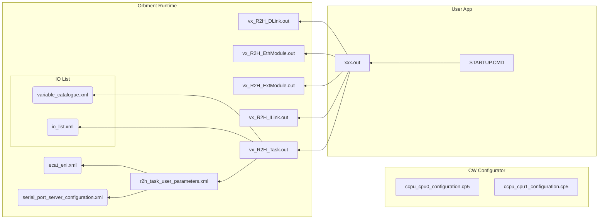

```mermaid
graph RL
	subgraph CW Configurator
		ccpu_cpu0_configuration.cp5
		ccpu_cpu1_configuration.cp5
	end
	subgraph Orbment Runtime
		vx_R2H_DLink.out
		vx_R2H_EthModule.out
		vx_R2H_ExtModule.out
		vx_R2H_ILink.out
		vx_R2H_Task.out --> r2h_task_user_parameters.xml
		r2h_task_user_parameters.xml --> ecat_eni(ecat_eni.xml)
		r2h_task_user_parameters.xml --> serial_port_server_configuration(serial_port_server_configuration.xml)
		vx_R2H_Task.out ---> variable_catalogue
		vx_R2H_Task.out ---> io_list
		subgraph IO List
			variable_catalogue(variable_catalogue.xml)
			io_list(io_list.xml)
		end
	end
	subgraph User App
		xxx.out --> vx_R2H_DLink.out
		xxx.out --> vx_R2H_EthModule.out
		xxx.out --> vx_R2H_ExtModule.out
		xxx.out --> vx_R2H_ILink.out
		xxx.out --> vx_R2H_Task.out
		STARTUP.CMD --> xxx.out
	end
```

